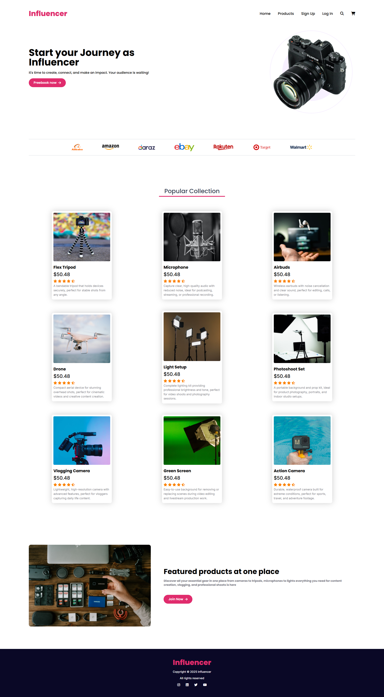

# Influencer Web Design

This is a beginner-friendly, responsive influencer-themed landing page built using **HTML** and **Tailwind CSS**. It is part of my learning journey as a web developer.

## 🔗 Live Demo

[View Live Website](https://obaidullah-miazi-dev.github.io/Influencer-web-design)

## 📸 Project Preview

 <!-- Add a real screenshot file in your repo -->

## 🛠️ Technologies Used

- HTML5
- Tailwind CSS

## 💡 Features

- Responsive design for all devices
- Clean and modern layout
- Hero section with CTA
- Product showcase area
- Stylish layout with utility-first CSS

## 📁 Folder Structure

Influencer-web-design/
├── index.html
├── style.css
├── images/
├── logos/
└── README.md


## 🚀 Getting Started

To view or edit the project locally:

1. Clone the repository:
   ```bash
   git clone https://github.com/obaidullah-miazi-dev/Influencer-web-design.git

2. Open index.html in your browser or a code editor like VS Code.


📌 Learning Purpose
This project is created as part of my journey to become a Full-Stack Web Developer using the Tailwind CSS framework. It's my very first project with Tailwind.

📬 Contact
If you want to give feedback or connect:

GitHub:(https://github.com/obaidullah-miazi-dev)  

LinkedIn: (http://www.linkedin.com/in/obaidullah-miazi)  

Email: (obaidullahmiazi.dev@gmail.com)
